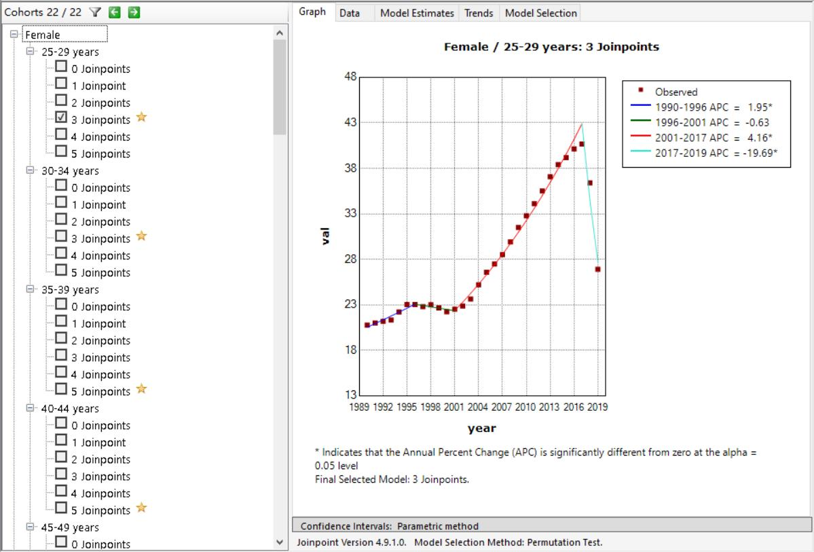

## 利用Joinpoint观察疾病负担的时间序列

### Joinpoint回归模型

#### 模型简介

​		时间趋势分析是流行病学研究的重要组成部分。传统的回归模型主要从全局的角度对研究时间范围内疾病分布的整体趋势进行拟合评价，无法呈现局部的变化特征；而Joinpoint回归模型的核心思想是根据疾病分布的时间特征建立分段回归，通过若干连接点将研究时间分割成不同区间，并对每个区间进行趋势拟合和优化，进而更详细地评价全局时间范围内不同区间特异性的疾病变化特征。

​		目前，Joinpoint回归模型已被用于估计加拿大、英国、日本、意大利等众多国家癌症发病率的变化趋势，并分析了丹麦自杀率的变化（[Dyvesether 等人，2018 年](https://www.sciencedirect.com/science/article/pii/S2405844019361754#br0050)），以及新交通法规实施后驾驶员死亡率的变化（[Barrio 等人，2015 年](https://www.sciencedirect.com/science/article/pii/S2405844019361754#br0010)）等，是一种适用于多领域的颇具价值的时间序列分析方法。

#### 模型原理

​		Joinpoint回归模型有线性模型（$y=xb$）和对数线性模型（$lny=xb$）两种，如果因变量服从正态分布（或近似正态分布）且数据样本量较大（通常大于100）时选择线性模型；如果因变量服从指数分布或泊松分布，则宜选用对数线性模型。以下原理叙述以对数线性模型为例，线性模型同理。

​		假设有一组观测值$y$表示发病率或死亡率等指标，$x$表示有记录的时间结点（如2019年），$n$表示研究的时间跨度，以（$x_1$，$y_1$）, …，（$x_n$，$y_n$）表示，其中$x_1$≤…≤$x_n$，对数线性模型的回归方程式为
$$
E[y|x] = e^{\beta_0+\beta_1x+\delta_1(x-\tau_1)^++…+\delta_k(x-\tau_k)^+}
$$
其中$k$为连接点的个数，$\tau_k$表示连接点对应的时间，$\beta_0$为截距，$\beta_1$为回归系数，$\delta_k$为第$k$段分段函数（第$k$个转折点与第$k+1$个转折点之间）的回归系数。当$x-\tau_k>0$时，$(x-\tau_k)^+=x-\tau_k$，否则

$(x-\tau_k)^+=0$.

​		Joinpoint默认采用网格搜索法（grid search method, GSM）为建模方法。通过GSM建立所有可能存在的区间分段函数连接点（即Joinpoint点），并计算每种可能的情况下所对应的误差平方和（sum of squares errors，SSE）和均方误差（mean squared errors, MSE）, 选择MSE最小的网格点为分段函数连接点，并根据选定的连接点和区间函数拟合$\beta_0$、$\beta_1$、$\delta_k$等方程参数。

#### 模型优化

​		Joinpoint默认采用蒙特卡洛置换检验（Monte Carlo permutation test）为模型优化方法。建模之前，需要先设定连接点的数量范围， MIN表示最少连接点数，通常情况下可设为0；MAX表示最多连接点数。每一次置换检验会检验原假设$H_0$：设连接点数量$K=K_a$以及备择假设$H_1$：连接点数量$K=K_b (K_b\in(K_a,MAX))$。置换检验从$K_a=MIN, K_b=MAX$开始，如果拒绝$H_0$，则将$K_a+1$后再进行检验；如果不拒绝$H_0$，则将$K_b-1$后再次进行检验，直到$K_a=K_b$，此时$K=K_a=K_b$就是置换检验选出的最优连接点数，其对应的模型即为最优模型。

​		除蒙特卡洛置换检验外，还可以采用贝叶斯信息准则（bayesian information criterion，BIC）、校正贝叶斯信息准则（modified bayesian information criterion，MBIC）及相关衍生方法进行最优模型的筛选，主要面向特殊需求的高级用户使用。

#### 数据实践

​		下载GBD数据库中1990年至2019年中国大陆二型糖尿病疾病负担相关数据，评测指标为DALYs（rate）。由于数据跨度仅有30年，样本量较小，且经验证因变量通常不符合正态分布，故采用对数线性模型。

​		下载官方软件Joinpoint Regression Program，将数据按照要求格式导入。选择因变量类型为年龄调整的比率（Age-Adjusted Rate），其值为val列；时间变量为year，彼此间隔为一年；自变量还包括包括性别（sex，分为Female、Male）与年龄（age，25-75每5年为一类，75+为一类）这两个分类变量；选择标准误（standard error）作为异方差误差，其值根据原数据中的upper列和lower计算，取置信水平为95%，标准误SE的计算公式为：
$$
SE=(upper-lower)/(1.96*2)
$$

图1&emsp;Joinpoint模型设置截图
 

​		综合考虑到模型精度、复杂度和训练时间，设置最大连接点数为5，其余参数保持模型默认设置。模型运行结果如下图所示。例如对于25-29岁的女性，模型推荐的最优连接点数为3（1996年，2001年，2017年），具体数据可在*Data*、*Model Estimates*和*Trends*中查看。其余模型也可相应点击查看。

图二&emsp;Joinpoint模型运行结果截图

#### 数据分析
